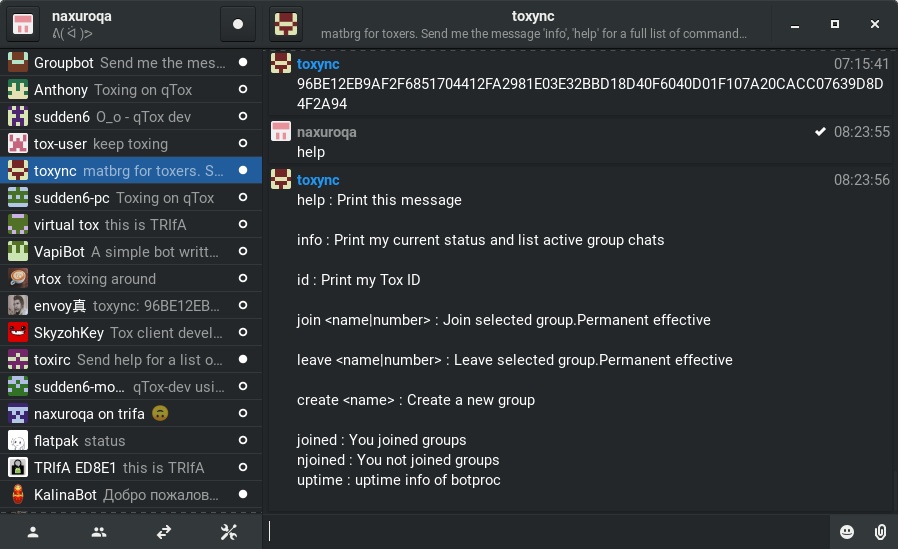
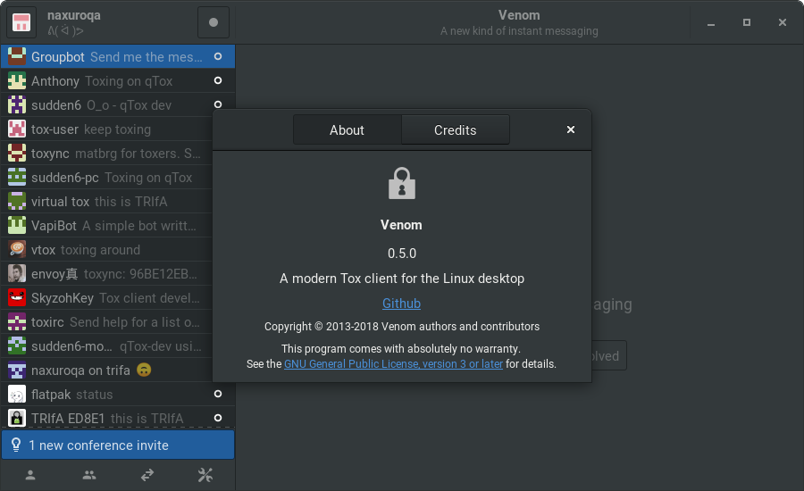

=====

[](https://travis-ci.org/naxuroqa/Venom)


[](http://tip4commit.com/projects/634)
[](https://codecov.io/gh/naxuroqa/Venom)
[](https://hosted.weblate.org/engage/venom/?utm_source=widget)

###### a modern [Tox](https://github.com/TokTok/c-toxcore) client for the GNU/Linux desktop





Features
--------

* Encrypted profiles
* Secure, private messaging
* Read receipts
* Contact aliases
* Customizable avatars
* Emojis 👍
* File transfers
* Screenshot sharing
* Group chats
* Socks5 Proxy support
* Spell checking
* Sound notifications
* [Faux offline messaging](https://wiki.tox.chat/users/offline_messaging)
* Voice and video chat

Roadmap
-------

See [projects](https://github.com/naxuroqa/Venom/projects) for planned features.

Translations
------------

Translations are done via the [venom project on weblate](https://hosted.weblate.org/projects/venom/translations/).
Don't create pull requests for translations here. Updated translations from weblate will be merged in this repository on every release.

FAQ
---

* Save file location

  Tox profiles and history files are saved in `$XDG_DATA_HOME/tox/`.
   * For the flatpak bundle `$XDG_DATA_HOME/tox/` is at `~/.var/app/com.github.naxuroqa.venom/tox/`
   * Otherwise `$XDG_DATA_HOME/tox/` is at `~/.local/share/tox/`

* Data file interoperability

  Tox data files from qTox and toxic can be reused, both encrypted and unencrypted.
  This only includes the `*.tox` files, all other files (history, etc.) are not supported.

Dependencies
------------

* `gtk+-3.0 >= 3.22`
* `glib-2.0 >= 2.56`
* `json-glib-1.0`
* `libcanberra >= 0.30`
* `libgee >= 0.20`
* `libsoup-2.4`
* `gspell >= 1.8`
* `sqlcipher`
* `toxcore >= 0.2`
* `libgstreamer1.0 >= 1.14`

Build-Dependencies
------------------
* `meson >= 0.46`
* `vala >= 0.40`

Compiling
---------
```bash
meson ./build && cd build
ninja
ninja install
```

Testing
-------
```bash
ninja test
```

Contact
-------

Join the `#tox` or `#toktok` IRC channels on [freenode](https://freenode.net/)
